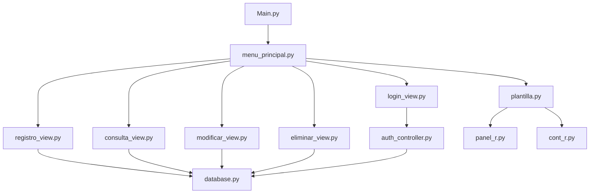
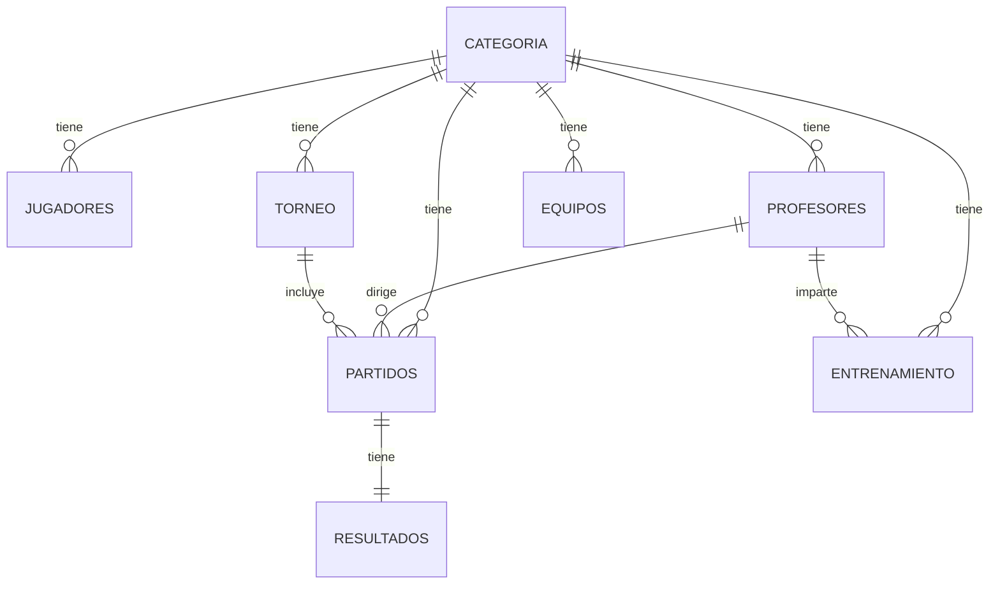

# Análisis Completo del Proyecto PROYECTO_INTEGRADOR_TUZOS

**Desarrollado por:** Equipo 4 - Integradora UTD  
**Universidad:** Universidad Tecnológica de Durango  
**Proyecto:** Sistema de Gestión Deportiva - Academia Tuzos  
**Fecha:** Diciembre 2024  
**Versión:** 1.1.7

## 📋 Resumen Ejecutivo

Este es un **Sistema de Gestión Deportiva** para la Academia Tuzos, desarrollado en Python con Tkinter/CustomTkinter como framework de interfaz gráfica y MySQL como base de datos. El sistema implementa un CRUD completo para gestionar jugadores, torneos, partidos, horarios, categorías, entrenamientos, profesores, equipos y usuarios, con funcionalidades avanzadas de exportación, búsqueda, dashboard estadístico y navegación intuitiva.

---

## 🏗️ Arquitectura del Sistema

### Patrón de Diseño
- **Arquitectura MVC (Modelo-Vista-Controlador)** adaptada
- **Separación de responsabilidades** clara entre capas
- **Componentes reutilizables** para la interfaz gráfica

### Estructura de Capas



---

## 📁 Estructura de Archivos

### Archivos Principales (401 líneas)

#### **Main.py** (5 líneas)
- Punto de entrada de la aplicación
- Inicializa el sistema completo

#### **menu_principal.py** (818 líneas) ⭐
**Clase Principal:** `SistemaCompleto`

**Responsabilidades:**
- Gestión del flujo de navegación completo
- Control de sesión de usuario
- Coordinación entre módulos CRUD
- Gestión de menús y submenús
- **Dashboard con estadísticas en tiempo real**
- **Sistema de búsqueda global**
- **Historial de navegación**
- **Atajos de teclado globales**

**Métodos Clave:**
- `iniciar()`: Inicia el sistema
- `mostrar_login()`: Muestra pantalla de login
- `mostrar_menu_principal()`: Menú principal con opciones CRUD y dashboard
- `mostrar_resumen_general()`: Dashboard con estadísticas y próximos partidos
- `_buscar_funcion()`: Sistema de búsqueda global
- `_agregar_al_historial()`: Gestión de historial de navegación
- `_retroceder_navegacion()`: Navegación hacia atrás (Ctrl+Backspace)
- `_mostrar_submenu()`: Genera submenús dinámicos
- `cerrar_sesion()`: Cierra sesión y regresa al login

**Atajos de Teclado:**
- `Ctrl+R`: Registrar
- `Ctrl+M`: Modificar
- `Ctrl+Q`: Consultar
- `Ctrl+E`: Eliminar
- `Ctrl+Backspace`: Volver atrás

**Flujo de Navegación:**
```
Login → Menú Principal → Dashboard/CRUD → [Registrar|Consultar|Modificar|Eliminar] → Submenú → Acción
```

---

### Módulos de Vista

#### **login_view.py** (96 líneas)
**Clase:** `LoginApp`

**Características:**
- Interfaz de autenticación con diseño personalizado
- Validación de credenciales contra base de datos
- Uso de componentes redondeados (`PanelR`, `ContR`)
- Manejo de transparencias con `pywinstyles`
- Callback `on_login_success` para integración

**Campos:**
- Usuario
- Contraseña (oculta con asteriscos)

#### **registro_view.py** (856 líneas)
**Clases de Registro (8 clases):**

1. **RegistroApp_partido**
   - Campos: Día, Fecha, Hora, Equipo Local, Equipo Visitante, Profesor, Lugar, Categoría, Tipo, Torneo
   - Relaciones: Profesor (FK), Categoría (FK), Torneo (FK, opcional)
   - **Campo dinámico Torneo:** Solo visible si Tipo = "Torneo"

2. **RegistroApp_horarios**
   - Campos: Ocupación, Hora, Día, Disponibilidad
   
3. **RegistroApp_entrenamiento**
   - Campos: Día, Hora, Profesor, Categoría
   - Relaciones: Profesor (FK), Categoría (FK)

4. **RegistroApp_equipos** (Categorías)
   - Campos: Nombre de categoría
   
5. **RegistroApp_jugador**
   - Campos: Nombre, Apellidos, CURP, Categoría, Número de jugador, Fecha de inscripción
   - Relaciones: Categoría (FK)
   - Validación: CURP único

6. **RegistroApp_torneo**
   - Campos: Nombre, Categoría, Cantidad de equipos, Duración, Fecha inicial, Fecha término
   - Relaciones: Categoría (FK)
   - **Formato de fechas:** "Día DD de Mes a las HH:MM"

7. **RegistroApp_profesor**
   - Campos: Nombre, Apellidos, Categoría
   - Relaciones: Categoría (FK)

8. **RegistroApp_usuario**
   - Campos: Usuario, Email, Password
   - **Validación Email:** Regex para formato válido
   - Validación: Usuario único

**Características Comunes:**
- Formularios con diseño consistente
- Validación de campos obligatorios
- **Navegación con Enter entre campos**
- Mensajes de confirmación/error
- Botón de limpiar campos
- Uso de `DateEntry` para fechas
- Comboboxes para relaciones FK

#### **consulta_view.py** (1091 líneas)
**Clase:** `ConsultaApp`

**Funcionalidades:**
- Visualización de datos en tablas (Treeview)
- Búsqueda en tiempo real
- Filtrado de datos
- Exportación a múltiples formatos:
  - CSV
  - Excel (con openpyxl)
  - PDF (con reportlab)
- Copiar datos al portapapeles
- Actualizar datos
- **Vista Toggle para Partidos** (Básica/Detallada)
- **Tabla de Resultados de Partidos**
- Interfaz responsive con scrollbars
- **Columnas auto-ajustables**
- **Filas con colores alternados**

**Métodos de Consulta (9):**
- `consultar_jugadores()`
- `consultar_torneos()` - Con formato de fechas mejorado
- `consultar_partidos()` - Con vista toggle básica/detallada
- `consultar_horarios()`
- `consultar_categorias()`
- `consultar_entrenamientos()`
- `consultar_profesores()`
- `consultar_usuarios()`
- `consultar_resultados()` - **NUEVO:** Resultados de partidos con ganadores

**Características Destacadas:**
- JOINs para mostrar nombres en lugar de IDs
- Manejo de dependencias opcionales (pandas, reportlab)
- Formato de fechas y horas legible ("Día DD de Mes a las HH:MM")
- **Vista Toggle:** Alterna entre información básica y detallada
- **Headers personalizados:** Headers centrados con mayor tamaño de fuente

#### **modificar_view.py** (1117 líneas)
**Clase:** `ModificarApp`

**Funcionalidades:**
- Selección de registro desde Combobox
- Carga automática de datos al formulario
- Actualización de registros
- Validación de datos
- Manejo de relaciones FK
- **Gestión de Resultados de Partidos**
- **Campo Torneo dinámico** (solo visible si Tipo = "Torneo")

**Métodos de Actualización (8):**
- `actualizar_jugador()`
- `actualizar_torneo()`
- `actualizar_partido()` - **Con gestión de resultados (goles, ganador)**
- `actualizar_horario()`
- `actualizar_categoria()`
- `actualizar_entrenamiento()`
- `actualizar_profesor()`
- `actualizar_usuario()`

**Características:**
- Formularios dinámicos según tabla
- Carga de datos relacionados (profesores, categorías, torneos)
- Validación de campos únicos
- **Sección de Resultados:** Goles Local, Goles Visitante, Ganador
- **Cálculo automático de ganador/perdedor**
- Mensajes de confirmación

#### **eliminar_view.py** (755 líneas)
**Clase:** `EliminarApp`

**Funcionalidades:**
- Listado de registros en Combobox
- Vista previa de datos antes de eliminar
- Confirmación de eliminación
- Manejo de restricciones FK
- **Trigger de auditoría** (guarda partidos eliminados)

**Métodos de Eliminación (9):**
- `eliminar_jugador()`
- `eliminar_torneo()`
- `eliminar_partido()` - **Con trigger de respaldo**
- `eliminar_horario()`
- `eliminar_categoria()`
- `eliminar_entrenamiento()`
- `eliminar_profesor()`
- `eliminar_usuario()`
- `eliminar_equipo()` - **NUEVO**

**Características:**
- Método genérico `_eliminar_registro()`
- Validación de selección
- Limpieza de interfaz post-eliminación
- **Respaldo automático** de partidos eliminados vía trigger

---

### Módulos de Componentes UI

#### **plantilla.py** (477 líneas)
**Clase:** `plantilla_f`

**Responsabilidades:**
- Header principal del sistema
- Fondo de la aplicación responsive
- Diseño base reutilizable
- **Barra de búsqueda global**
- **Tooltip de perfil con reloj en tiempo real**

**Componentes:**
- Logo de la academia
- Texto de bienvenida
- Barra decorativa
- Fondo con imagen redimensionable
- **Icono de perfil con tooltip**
- **Botón de inicio**

**Método:** `header_v2()`
- Header mejorado con controles adicionales
- Barra de búsqueda con sugerencias
- Iconos de menú y usuario
- **Tooltip dinámico:** Usuario actual + reloj actualizado cada segundo
- **Panel de sugerencias:** Búsqueda con autocompletado

**Características:**
- **Redimensionamiento responsive** con debounce
- **Manejo de eventos** de foco para búsqueda
- **Navegación con Enter** en búsqueda

#### **panel_r.py** (32 líneas)
**Clase:** `PanelR` (Canvas personalizado)

**Características:**
- Paneles con bordes redondeados
- Personalización de colores (borde e interior)
- Transparencia con `pywinstyles`
- Algoritmo de suavizado de esquinas

**Parámetros:**
- `w`, `h`: Ancho y alto
- `bord_w`: Grosor del borde
- `n_rad`: Radio de redondeo
- `bord_col`: Color del borde
- `in_col`: Color interior

#### **cont_r.py** (52 líneas)
**Clases:**

1. **ContR** - Contenedor rectangular redondeado
   - Botones personalizados
   - Efectos hover (sunken/raised)
   - Texto centrado
   - Transparencia

2. **Cont_Cr** - Contenedor circular
   - Elementos circulares decorativos
   - Iconos de usuario

---

### Módulos de Datos

#### **database.py** (45 líneas)
**Clase:** `Database`

**Responsabilidades:**
- Conexión a MySQL
- Ejecución de queries
- Obtención de datos

**Configuración:**
- Host: localhost
- Usuario: root
- Password: (vacío)
- Base de datos: Academia_Tuzos

**Métodos:**
- `connect()`: Establece conexión
- `execute_query(query, params)`: Ejecuta INSERT/UPDATE/DELETE
- `fetch_all(query, params)`: Ejecuta SELECT
- `close()`: Cierra conexión

**Características:**
- Uso de parámetros preparados (prevención SQL injection)
- Manejo de errores con try/except
- Auto-commit de transacciones

#### **auth_controller.py** (21 líneas)
**Función:** `validar_credenciales(usuario, password)`

**Responsabilidades:**
- Validación de login
- Consulta a tabla USUARIOS
- Retorna True/False

**Seguridad:**
> [!WARNING]
> Las contraseñas se almacenan en **texto plano** en la base de datos. Esto es una **vulnerabilidad crítica de seguridad**.

---

### Base de Datos

#### **academia_tuzos.sql** (535 líneas)

**Tablas (11):**

1. **categoria**
   - `ID_Categoria` (PK, AUTO_INCREMENT)
   - `Nombre` (VARCHAR 50)
   - Datos: Sub-8, Sub-10, Sub-12, Sub-14, Sub-16, Sub-18, Sub-20, Absoluto, Femenil, Veteranos

2. **jugadores**
   - `ID_jugador` (PK, AUTO_INCREMENT)
   - `Nombre`, `Apellidos`, `CURP`, `Numero_jugador`, `Inscripcion`
   - `Categoria` (FK → categoria)

3. **profesores**
   - `Id_Profesores` (PK, AUTO_INCREMENT)
   - `Nombre`, `Apellidos`
   - `Categoria` (FK → categoria)

4. **torneo**
   - `Id_Torneo` (PK, AUTO_INCREMENT)
   - `Nombre_torneo`, `Cantidad_Equipos`, `Duracion`, `Fecha_Inicial`, `Fecha_Termino`
   - `Categoria` (FK → categoria)

5. **equipos** - **NUEVO**
   - `ID_Equipo` (PK, AUTO_INCREMENT)
   - `Nombre_Equipo`, `Color_Uniforme`, `Anio_Fundacion`
   - `Categoria` (FK → categoria)

6. **partidos**
   - `Id_Partidos` (PK, AUTO_INCREMENT)
   - `Dia`, `Fecha`, `Hora`, `Equipo_Local`, `Equipo_Visitante`, `Lugar`, `Tipo`
   - `Profesor` (FK → profesores)
   - `Categoria` (FK → categoria)
   - `ID_Torneo` (FK → torneo, NULLABLE) - **NUEVO**

7. **resultados** - **NUEVO**
   - `Id_Resultado` (PK, AUTO_INCREMENT)
   - `Id_Partido` (FK → partidos)
   - `Goles_Local`, `Goles_Visitante`, `Ganador`, `Perdedor`

8. **partidos_eliminados** - **NUEVO (Auditoría)**
   - `Id_Partido`, `Dia`, `Hora`, `Equipo_Local`, `Equipo_Visitante`
   - `Profesor`, `Lugar`, `Categoria`, `Tipo`, `Fecha_Eliminado`
   - **Trigger:** `trg_before_delete_partidos`

9. **entrenamiento**
   - `Id_Entrenamiento` (PK, AUTO_INCREMENT)
   - `Dia`, `Hora`
   - `Profesor` (FK → profesores)
   - `Categoria` (FK → categoria)

10. **horario**
    - `ID_Horario` (PK, AUTO_INCREMENT)
    - `Ocupacion`, `Hora`, `Dia`, `Disponibilidad` (BOOLEAN)

11. **usuarios**
    - `id` (PK, AUTO_INCREMENT)
    - `usuario`, `email`, `password`

**Vista:**
- **vista_estadisticas_equipos** - Cuenta partidos jugados por equipo

**Relaciones:**


---

## 🎨 Diseño de Interfaz

### Paleta de Colores

| Color | Código | Uso |
|-------|--------|-----|
| Azul Oscuro | `#212544` | Header, botones principales |
| Naranja | `#EF7D1A` | Decoración header |
| Amarillo | `#FFB93B` | Botones de acción, acentos |
| Gris Claro | `#CCCBCB` | Contenedores |
| Gris Medio | `#D9D9D9` | Inputs, paneles |
| Gris Oscuro | `#E0E0E0` | Fondos de formularios |
| Blanco | `#FCFCFC` | Texto principal |
| Rojo | `#FF6B6B` | Botón cerrar sesión |

### Tipografía
- **Fuente principal:** Arial
- **Tamaños:**
  - Títulos: 18-20px bold
  - Subtítulos: 14-16px bold
  - Texto normal: 12-13px
  - Labels: 12px

### Componentes Personalizados
- Bordes redondeados en todos los contenedores
- Efectos de transparencia con `pywinstyles`
- Botones con efectos hover
- Iconos decorativos

---

## 🔧 Dependencias

### requirements.txt
```
mysql-connector-python
pywinstyles
Pillow
tkcalendar
pandas
reportlab
python-dotenv
pytest
```

### Dependencias Detalladas
- `tkinter` / `customtkinter` - Framework de interfaz gráfica
- `mysql-connector-python` - Conexión MySQL
- `pywinstyles` - Estilos de ventana Windows
- `Pillow` - Procesamiento de imágenes
- `tkcalendar` - Selectores de fecha
- `pandas` - Exportación Excel
- `reportlab` - Exportación PDF
- `python-dotenv` - Variables de entorno (configuración)
- `pytest` - Framework de testing

---

## ⚡ Funcionalidades Principales

### 1. Sistema de Autenticación
- Login con usuario y contraseña
- Validación contra base de datos
- Manejo de sesión activa
- Cierre de sesión
- **Información de usuario en header**

### 2. CRUD Completo (9 entidades)
- **Registrar:** Formularios para todas las entidades (Jugadores, Partidos, Torneos, Horarios, Entrenamientos, Categorías, Profesores, Usuarios, Equipos)
- **Consultar:** Visualización en tablas con búsqueda y exportación
- **Modificar:** Edición de registros existentes con gestión de resultados
- **Eliminar:** Eliminación con confirmación y auditoría

### 3. Dashboard Estadístico ⭐ **NUEVO**
- **Resumen General** con estadísticas en tiempo real
- Contadores: Total jugadores, torneos activos, partidos programados, profesores
- **Calendario de próximos partidos**
- Indicadores visuales con colores

### 4. Gestión de Torneos y Partidos
- Asignación de partidos a torneos
- **Campo dinámico de torneo** (visible solo si tipo = "Torneo")
- Fechas formateadas ("Día DD de Mes a las HH:MM")
- Vista toggle básica/detallada en consulta de partidos

### 5. Gestión de Resultados ⭐ **NUEVO**
- Registro de goles (Local/Visitante)
- Cálculo automático de ganador/perdedor
- Consulta de resultados en tabla dedicada
- Actualización de resultados desde modificar partidos

### 6. Exportación de Datos
- CSV
- Excel (XLSX) con formato
- PDF con tablas y headers

### 7. Búsqueda y Navegación
- **Búsqueda global** con sugerencias
- Búsqueda en tiempo real en tablas
- Filtrado por columnas
- Copiar datos al portapapeles
- **Historial de navegación** (stack-based)
- **Atajos de teclado** (Ctrl+R/M/Q/E, Ctrl+Backspace)

### 8. Validaciones y Controles
- Campos obligatorios
- Unicidad (CURP, usuario)
- **Validación de email** con regex
- Formatos de fecha
- Relaciones de integridad referencial
- **Navegación con Enter** entre campos

### 9. UI/UX Mejorada ⭐ **NUEVO**
- **Tooltip de perfil** con usuario y reloj en tiempo real
- **Fondo responsive** que se ajusta al redimensionar
- **Columnas auto-ajustables** en tablas
- **Filas con colores alternados**
- Headers de tabla centrados y con mayor tamaño
- Botones con efectos hover
- Transparencias y bordes redondeados

---

## 🐛 Problemas Identificados

### Críticos

> [!CAUTION]
> **Seguridad: Contraseñas en texto plano**
> - Las contraseñas se almacenan sin encriptación
> - **Solución:** Implementar hashing con `bcrypt` o `hashlib`

> [!WARNING]
> **SQL Injection parcialmente mitigado**
> - Aunque se usan parámetros preparados, revisar todas las queries
> - Validar inputs del usuario

### Importantes

> [!IMPORTANT]
> **Gestión de conexiones a BD**
> - Se crea una nueva conexión en cada operación
> - No hay pool de conexiones
> - **Impacto:** Rendimiento en operaciones concurrentes

> [!IMPORTANT]
> **Manejo de errores incompleto**
> - Muchos `try/except` solo imprimen errores
> - No hay logging estructurado
> - Mensajes de error no siempre informativos para el usuario

### Menores

- **Código duplicado:** Mucho código repetido en las vistas CRUD
- **Hardcoded values:** Rutas de imágenes, configuración de BD
- **Sin configuración externa:** No hay archivo `.env` o `config.py`
- **Falta documentación:** Pocos docstrings en funciones
- **Sin tests:** No hay pruebas unitarias ni de integración

---

## 💡 Fortalezas del Código

### ✅ Buenas Prácticas

1. **Separación de responsabilidades**
   - Vistas separadas por funcionalidad
   - Controlador de autenticación independiente
   - Capa de datos aislada

2. **Componentes reutilizables**
   - `PanelR`, `ContR` para UI consistente
   - Plantilla base para todas las vistas

3. **Diseño visual coherente**
   - Paleta de colores consistente
   - Componentes con estilo uniforme

4. **Uso de parámetros preparados**
   - Prevención básica de SQL injection

5. **Validaciones de datos**
   - Campos obligatorios
   - Unicidad de registros

---

## 🚀 Recomendaciones de Mejora

### Seguridad

1. **Encriptar contraseñas**
```python
import bcrypt

# Al registrar
hashed = bcrypt.hashpw(password.encode('utf-8'), bcrypt.gensalt())

# Al validar
bcrypt.checkpw(password.encode('utf-8'), hashed)
```

2. **Variables de entorno**
```python
# .env
DB_HOST=localhost
DB_USER=root
DB_PASSWORD=
DB_NAME=Academia_Tuzos

# database.py
from dotenv import load_dotenv
import os

load_dotenv()
host = os.getenv('DB_HOST')
```

3. **Validación de inputs**
```python
import re

def validar_email(email):
    pattern = r'^[\w\.-]+@[\w\.-]+\.\w+$'
    return re.match(pattern, email) is not None
```

### Arquitectura

4. **Patrón Repository**
```python
class JugadorRepository:
    def __init__(self, db):
        self.db = db
    
    def crear(self, jugador):
        query = "INSERT INTO jugadores (...) VALUES (...)"
        return self.db.execute_query(query, jugador)
    
    def obtener_todos(self):
        query = "SELECT * FROM jugadores"
        return self.db.fetch_all(query)
```

5. **Pool de conexiones**
```python
from mysql.connector import pooling

connection_pool = pooling.MySQLConnectionPool(
    pool_name="academia_pool",
    pool_size=5,
    host='localhost',
    database='Academia_Tuzos',
    user='root',
    password=''
)
```

### Código Limpio

6. **Constantes centralizadas**
```python
# constants.py
class Colors:
    PRIMARY = "#212544"
    SECONDARY = "#FFB93B"
    DANGER = "#FF6B6B"
    
class Fonts:
    TITLE = ("Arial", 18, "bold")
    NORMAL = ("Arial", 12)
```

7. **Logging estructurado**
```python
import logging

logging.basicConfig(
    filename='academia.log',
    level=logging.INFO,
    format='%(asctime)s - %(levelname)s - %(message)s'
)

logging.info(f"Usuario {usuario} inició sesión")
```

8. **Refactorizar código duplicado**
```python
class BaseCRUDView:
    def __init__(self, parent, tabla):
        self.parent = parent
        self.tabla = tabla
        self.db = Database()
        self.crear_interfaz()
    
    def crear_interfaz(self):
        # Código común para todas las vistas CRUD
        pass
```

### Testing

9. **Pruebas unitarias**
```python
import unittest

class TestAuthController(unittest.TestCase):
    def test_validar_credenciales_correctas(self):
        result = validar_credenciales("admin", "admin123")
        self.assertTrue(result)
    
    def test_validar_credenciales_incorrectas(self):
        result = validar_credenciales("admin", "wrong")
        self.assertFalse(result)
```

### UX/UI

10. **Feedback visual**
```python
# Indicador de carga
def mostrar_loading(self):
    self.loading_label = tk.Label(self.frame, text="Cargando...")
    self.loading_label.pack()
    self.frame.update()

def ocultar_loading(self):
    self.loading_label.destroy()
```

11. **Validación en tiempo real**
```python
def validar_curp(event):
    curp = entry_curp.get()
    if len(curp) == 18:
        label_validacion.config(text="✓", fg="green")
    else:
        label_validacion.config(text="✗", fg="red")

entry_curp.bind('<KeyRelease>', validar_curp)
```

---

## 📊 Métricas del Código

| Métrica | Valor |
|---------|-------|
| **Total de líneas** | ~5,000+ |
| **Archivos Python** | 13 |
| **Clases** | 20+ |
| **Tablas BD** | 11 (8 principales + 3 nuevas) |
| **Vistas BD** | 1 (vista_estadisticas_equipos) |
| **Triggers BD** | 1 (auditoría partidos eliminados) |
| **Operaciones CRUD** | 36 (9 entidades × 4 operaciones) |
| **Funcionalidades** | 50+ (CRUD + Dashboard + Exportación + Búsqueda + Resultados) |
| **Dependencias** | 8 |
| **Atajos de teclado** | 5 |

---

## 🎯 Conclusión

### Resumen General

Este proyecto es un **sistema CRUD completo y funcional** para la gestión de una academia deportiva. Presenta una arquitectura bien estructurada con separación de responsabilidades y componentes reutilizables.

### Puntos Fuertes
- ✅ Interfaz gráfica atractiva y coherente
- ✅ CRUD completo para 9 entidades
- ✅ Dashboard con estadísticas en tiempo real
- ✅ Gestión completa de torneos y resultados
- ✅ Exportación de datos a múltiples formatos (CSV, Excel, PDF)
- ✅ Sistema de búsqueda global con sugerencias
- ✅ Navegación intuitiva con historial y atajos de teclado
- ✅ Vista toggle para partidos (básica/detallada)
- ✅ Búsqueda y filtrado de información
- ✅ Componentes UI personalizados y reutilizables
- ✅ Validaciones avanzadas (email, CURP, unicidad)
- ✅ Auditoría de eliminaciones con trigger
- ✅ UI/UX mejorada con tooltips, reloj en tiempo real, responsive

---

© 2025 Equipo 4 - Universidad Tecnológica de Durango
